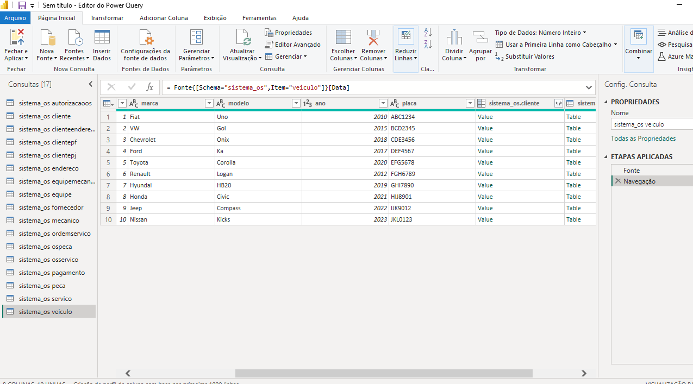
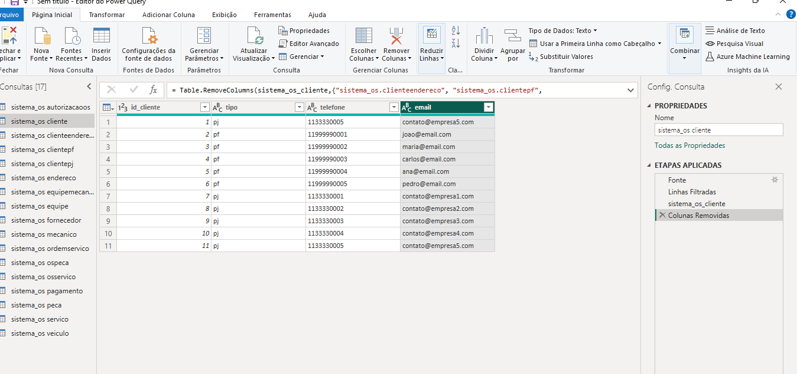

# 🚗🔧 Análise de Ordens de Serviço e Desempenho da Oficina  

Este projeto foi desenvolvido com **MySQL + Power BI**, transformando dados de uma oficina mecânica em **insights visuais** e **indicadores de negócio**.  
O objetivo foi criar um **dashboard interativo** que auxilia na gestão de clientes, veículos, ordens de serviço, peças, serviços e pagamentos.  

➡️ [👉 Clique aqui para acessar o relatório online no Power BI](https://app.powerbi.com/groups/me/reports/75ac0e03-c504-44d6-9c8f-6022ecbbf00b/c19a28146d6496b42826?bookmarkGuid=98cd7d18-570c-4963-b460-99455e1e840f&bookmarkUsage=1&ctid=3fedf2f7-4b56-4eb0-b3eb-46577b2a3f9e&portalSessionId=f2aa7be9-75b5-42fc-919f-ae80e3385654&fromEntryPoint=export)  

---

## 📊 Dashboard Final  

📸 **Captura de tela 2025-09-19 103112.png**  
  

O dashboard traz os principais **KPIs da oficina**:
- 💰 Receita total  
- 👥 Total de clientes atendidos  
- 🔩 Quantidade de peças vendidas  
- 📑 Total de ordens de serviço abertas  

Além de gráficos sobre: veículos mais atendidos, formas de pagamento, evolução mensal das OS, serviços mais realizados e peças mais vendidas.  

---

## 🛠️ Etapas do Projeto  

### 🔹 1. Explorando os dados no Power Query  
📸 **dados_sem_coluna_removidas.png**  
  
Os dados importados do MySQL foram analisados diretamente no **Power Query**, garantindo que as tabelas estavam corretas antes das transformações.  

---

### 🔹 2. Mesclagem das tabelas de clientes  
📸 **mesclar_tabelas.png**  
  
Os dados de clientes estavam divididos em:  
- `clientepf` (Pessoa Física)  
- `clientepj` (Pessoa Jurídica)  

Mesclei essas tabelas com `cliente` para **unificar as informações** em uma dimensão única de clientes.  

---

### 🔹 3. Removendo colunas desnecessárias  
📸 **removendo_ascolunas.png**  
  
Após a mesclagem, eliminei colunas redundantes, deixando apenas os atributos necessários (nome/razão social, telefone, e-mail, etc.).  
Isso tornou o modelo **mais limpo e otimizado**.  

---

### 🔹 4. Construção do modelo no Power BI  
📸 **db_SQL.pbix**  
O arquivo `.pbix` contém todo o modelo de dados, relações e medidas DAX criadas.  

Algumas medidas utilizadas:
```DAX
TotalOS = COUNTROWS(ordemServico)

ReceitaTotal = SUM(ordemServico[valor_total])

TotalClientes = DISTINCTCOUNT(ordemServico[id_cliente])

QtdPecasVendidas = SUM(osPeca[quantidade])
