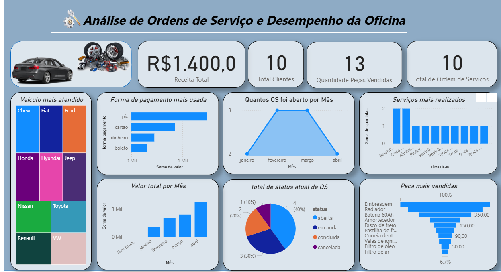
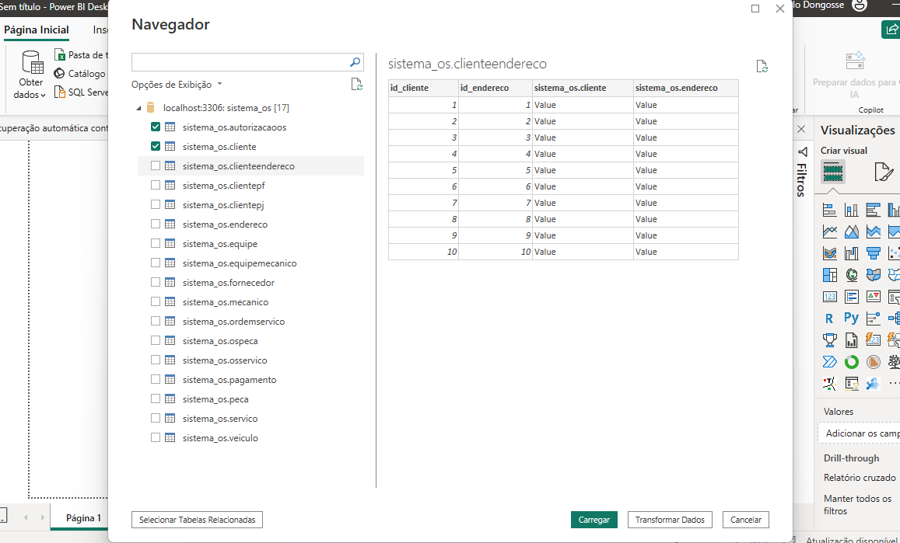
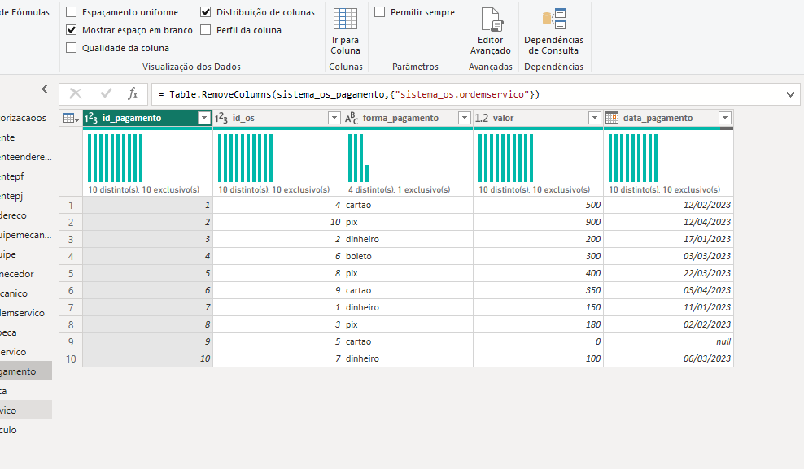

# 🚗🔧 Análise de Ordens de Serviço e Desempenho da Oficina  

Este projeto foi desenvolvido com **MySQL + Power BI**, transformando dados de uma oficina mecânica em **insights visuais** e **indicadores de negócio**.  
O objetivo foi criar um **dashboard interativo** que auxilia na gestão de clientes, veículos, ordens de serviço, peças, serviços e pagamentos.  

➡️ [👉 Clique aqui para acessar o relatório online no Power BI](https://app.powerbi.com/groups/me/reports/75ac0e03-c504-44d6-9c8f-6022ecbbf00b/c19a28146d6496b42826?bookmarkGuid=98cd7d18-570c-4963-b460-99455e1e840f&bookmarkUsage=1&ctid=3fedf2f7-4b56-4eb0-b3eb-46577b2a3f9e&portalSessionId=f2aa7be9-75b5-42fc-919f-ae80e3385654&fromEntryPoint=export)  

---

## 📊 Dashboard Final  

📸 **Captura de tela 2025-09-19 103112.png**  
  

Aqui está o resultado final do dashboard no Power BI.  
Ele traz os principais **KPIs da oficina**:
- 💰 Receita total  
- 👥 Total de clientes atendidos  
- 🔩 Quantidade de peças vendidas  
- 📑 Total de ordens de serviço abertas  

Além disso, gráficos dinâmicos mostram:  
- Veículos mais atendidos  
- Formas de pagamento utilizadas  
- Evolução mensal das OS  
- Serviços mais realizados  
- Peças mais vendidas  

---

## 🛠️ Etapas do Projeto  

### 🔹 1. Tabelas do MySQL 
📸 **Captura de tela 2025-09-19 105526.png**  
   
No Navegador do Power BI, após conectar ao MySQL, é possível visualizar todas as tabelas do banco `sistema_os`.  
Esse print mostra a listagem das tabelas e a seleção de quais seriam importadas para análise.  

---

### 🔹 2. Visualizando os Dados Brutos no Power Query  
📸 **dados_sem_coluna_removidas.png**  
  

Nesta etapa explorei as tabelas importadas do MySQL, como a de **veículos**.  
É a visão inicial dos dados, **sem tratamento nem limpeza**, apenas para confirmar se tudo estava sendo carregado corretamente no Power BI.  

---

### 🔹 3. Mesclagem de Tabelas de Clientes  
📸 **mesclar_tabelas.png**  
  

Os dados de clientes estavam separados em **Pessoa Física (`clientepf`)** e **Pessoa Jurídica (`clientepj`)**.  
Com o **Power Query**, fiz a **mesclagem dessas tabelas** com a tabela `cliente`, criando uma visão única de clientes.  
Assim foi possível trabalhar tanto com nomes de pessoas físicas quanto com razões sociais das empresas em um só campo.  

---

### 🔹 4. Removendo Colunas Desnecessárias  
📸 **removendo_ascolunas.png**  
  

Após mesclar os dados, removi colunas que não eram úteis para as análises, como IDs internos e chaves que não precisavam aparecer nos relatórios.  
Isso deixou o modelo **mais limpo, leve e focado nos indicadores realmente importantes**.  

---
### Análise Rapida

   
No Editor de Consultas do Power BI, já com os dados importados do MySQL, é possível visualizar colunas como **forma de pagamento, valor e data do pagamento**.  
Esse print mostra a etapa de tratamento e validação dos dados antes da criação dos relatórios.

---
### 🔹 5. Arquivo Principal do Power BI  
📸 **db_SQL.pbix**  

O arquivo `.pbix` contém todo o modelo de dados, as transformações e as medidas DAX criadas.  

Algumas das medidas mais importantes foram:  

```DAX
TotalOS = COUNTROWS(ordemServico)

ReceitaTotal = SUM(ordemServico[valor_total])

TotalClientes = DISTINCTCOUNT(ordemServico[id_cliente])

QtdPecasVendidas = SUM(osPeca[quantidade])
